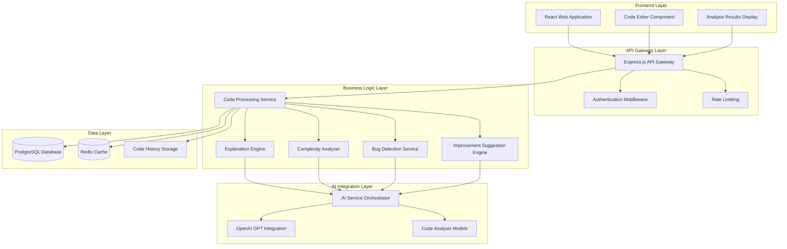

# System Design Document: Explain My Code AI

## Overview

Explain My Code AI is a web-based educational platform that provides comprehensive code analysis and explanations to help programming students understand code logic, complexity, and best practices. The system leverages AI to generate detailed, educational explanations that bridge the gap between copying code and truly understanding it.

The platform processes user-submitted code through multiple analysis engines to provide:
- Line-by-line explanations in educational language
- High-level logic summaries and flow analysis
- Algorithmic complexity analysis with practical explanations
- Bug detection with debugging hints
- Code improvement suggestions and best practices

## Architecture

The system follows a layered architecture pattern with clear separation of concerns:



## Components and Interfaces

### Frontend Components

**Code Editor Component**
- Syntax highlighting for multiple programming languages
- Real-time syntax validation
- Code submission interface with language detection
- Progress indicators during analysis

**Analysis Results Display**
- Tabbed interface for different analysis types
- Interactive code highlighting synchronized with explanations
- Expandable/collapsible sections for detailed analysis
- Export functionality for analysis results

**User Dashboard**
- Code submission history
- Saved analysis results
- Learning progress tracking

### Backend Services

**Code Processing Service**
```typescript
interface CodeProcessingService {
  processCode(request: CodeAnalysisRequest): Promise<CodeAnalysisResponse>
  validateSyntax(code: string, language: string): ValidationResult
  detectLanguage(code: string): string
  sanitizeCode(code: string): string
}

interface CodeAnalysisRequest {
  code: string
  language: string
  userId?: string
  analysisTypes: AnalysisType[]
}

interface CodeAnalysisResponse {
  explanations: LineExplanation[]
  logicSummary: LogicSummary
  complexityAnalysis: ComplexityAnalysis
  bugHints: BugHint[]
  improvements: ImprovementSuggestion[]
  processingTime: number
}
```

**Explanation Engine**
```typescript
interface ExplanationEngine {
  generateLineExplanations(code: ParsedCode): Promise<LineExplanation[]>
  generateLogicSummary(code: ParsedCode): Promise<LogicSummary>
  explainControlFlow(code: ParsedCode): Promise<FlowExplanation>
}

interface LineExplanation {
  lineNumber: number
  code: string
  explanation: string
  concepts: string[]
  difficulty: 'beginner' | 'intermediate' | 'advanced'
}
```

**Complexity Analyzer**
```typescript
interface ComplexityAnalyzer {
  analyzeTimeComplexity(code: ParsedCode): Promise<ComplexityResult>
  analyzeSpaceComplexity(code: ParsedCode): Promise<ComplexityResult>
  explainComplexity(complexity: string): string
}

interface ComplexityResult {
  bigONotation: string
  explanation: string
  practicalImplications: string
  improvementSuggestions: string[]
}
```

**Bug Detection Service**
```typescript
interface BugDetector {
  detectCommonErrors(code: ParsedCode): Promise<BugHint[]>
  analyzeLogicErrors(code: ParsedCode): Promise<LogicIssue[]>
  checkBestPractices(code: ParsedCode): Promise<PracticeViolation[]>
}

interface BugHint {
  type: 'syntax' | 'runtime' | 'logic' | 'performance'
  severity: 'low' | 'medium' | 'high'
  line: number
  description: string
  suggestion: string
  debuggingTips: string[]
}
```

**AI Service Orchestrator**
```typescript
interface AIServiceOrchestrator {
  processWithAI(prompt: string, context: AnalysisContext): Promise<AIResponse>
  generateExplanation(code: string, analysisType: string): Promise<string>
  optimizePrompts(userLevel: string): PromptTemplate
}
```

## Data Models

### Core Data Structures

**User Model**
```typescript
interface User {
  id: string
  email: string
  username: string
  skillLevel: 'beginner' | 'intermediate' | 'advanced'
  preferredLanguages: string[]
  createdAt: Date
  lastActive: Date
}
```

**Code Submission Model**
```typescript
interface CodeSubmission {
  id: string
  userId: string
  code: string
  language: string
  title?: string
  submittedAt: Date
  analysisStatus: 'pending' | 'processing' | 'completed' | 'failed'
  processingTime?: number
}
```

**Analysis Result Model**
```typescript
interface AnalysisResult {
  id: string
  submissionId: string
  explanations: LineExplanation[]
  logicSummary: LogicSummary
  complexityAnalysis: ComplexityAnalysis
  bugHints: BugHint[]
  improvements: ImprovementSuggestion[]
  generatedAt: Date
}
```

### Database Schema

```sql
-- Users table
CREATE TABLE users (
    id UUID PRIMARY KEY DEFAULT gen_random_uuid(),
    email VARCHAR(255) UNIQUE NOT NULL,
    username VARCHAR(100) UNIQUE NOT NULL,
    skill_level VARCHAR(20) DEFAULT 'beginner',
    preferred_languages TEXT[],
    created_at TIMESTAMP DEFAULT CURRENT_TIMESTAMP,
    last_active TIMESTAMP DEFAULT CURRENT_TIMESTAMP
);

-- Code submissions table
CREATE TABLE code_submissions (
    id UUID PRIMARY KEY DEFAULT gen_random_uuid(),
    user_id UUID REFERENCES users(id),
    code TEXT NOT NULL,
    language VARCHAR(50) NOT NULL,
    title VARCHAR(200),
    submitted_at TIMESTAMP DEFAULT CURRENT_TIMESTAMP,
    analysis_status VARCHAR(20) DEFAULT 'pending',
    processing_time INTEGER
);

-- Analysis results table
CREATE TABLE analysis_results (
    id UUID PRIMARY KEY DEFAULT gen_random_uuid(),
    submission_id UUID REFERENCES code_submissions(id),
    explanations JSONB,
    logic_summary JSONB,
    complexity_analysis JSONB,
    bug_hints JSONB,
    improvements JSONB,
    generated_at TIMESTAMP DEFAULT CURRENT_TIMESTAMP
);

-- User sessions for tracking learning progress
CREATE TABLE user_sessions (
    id UUID PRIMARY KEY DEFAULT gen_random_uuid(),
    user_id UUID REFERENCES users(id),
    session_start TIMESTAMP DEFAULT CURRENT_TIMESTAMP,
    codes_analyzed INTEGER DEFAULT 0,
    languages_used TEXT[],
    session_end TIMESTAMP
);
```

## API Design

### REST Endpoints

**Code Analysis Endpoints**
```typescript
// Submit code for analysis
POST /api/v1/analyze
Content-Type: application/json
{
  "code": "string",
  "language": "string",
  "analysisTypes": ["explanation", "complexity", "bugs", "improvements"]
}

Response: {
  "analysisId": "string",
  "status": "processing",
  "estimatedTime": "number"
}

// Get analysis results
GET /api/v1/analyze/{analysisId}
Response: {
  "status": "completed",
  "results": CodeAnalysisResponse
}

// Get analysis status
GET /api/v1/analyze/{analysisId}/status
Response: {
  "status": "processing" | "completed" | "failed",
  "progress": "number",
  "estimatedTimeRemaining": "number"
}
```

**User Management Endpoints**
```typescript
// User registration
POST /api/v1/users/register
{
  "email": "string",
  "username": "string",
  "password": "string",
  "skillLevel": "beginner" | "intermediate" | "advanced"
}

// User authentication
POST /api/v1/users/login
{
  "email": "string",
  "password": "string"
}

// Get user history
GET /api/v1/users/{userId}/history
Response: {
  "submissions": CodeSubmission[],
  "totalAnalyses": "number",
  "languagesUsed": "string[]"
}
```

**Language Support Endpoints**
```typescript
// Get supported languages
GET /api/v1/languages
Response: {
  "languages": [
    {
      "code": "python",
      "name": "Python",
      "version": "3.9+",
      "features": ["explanation", "complexity", "bugs", "improvements"]
    }
  ]
}

// Detect language from code
POST /api/v1/languages/detect
{
  "code": "string"
}
Response: {
  "language": "string",
  "confidence": "number"
}
```

## Security Considerations

### Input Validation and Sanitization
- **Code Sanitization**: Remove potentially harmful code patterns before processing
- **Input Length Limits**: Enforce maximum code length (1000 lines) to prevent abuse
- **Language Validation**: Verify submitted language is supported and matches detected language
- **SQL Injection Prevention**: Use parameterized queries for all database operations

### Authentication and Authorization
- **JWT-based Authentication**: Secure token-based authentication for API access
- **Rate Limiting**: Implement per-user and per-IP rate limiting to prevent abuse
- **API Key Management**: Secure storage and rotation of AI service API keys
- **User Data Protection**: Encrypt sensitive user data and code submissions

### AI Service Security
- **Prompt Injection Prevention**: Sanitize and validate all inputs sent to AI services
- **API Key Security**: Store AI service keys in secure environment variables
- **Response Validation**: Validate and sanitize AI-generated responses before displaying
- **Usage Monitoring**: Track AI service usage to detect anomalies and prevent abuse

## Scalability Considerations

### Horizontal Scaling
- **Microservices Architecture**: Each analysis component can be scaled independently
- **Load Balancing**: Distribute requests across multiple service instances
- **Database Sharding**: Partition user data and analysis results across multiple databases
- **CDN Integration**: Cache static assets and frequently accessed analysis results

### Performance Optimization
- **Caching Strategy**: 
  - Redis cache for frequently analyzed code patterns
  - Browser caching for static analysis results
  - Database query result caching
- **Asynchronous Processing**: Use message queues for long-running analysis tasks
- **Connection Pooling**: Optimize database connections and AI service calls
- **Code Preprocessing**: Cache parsed code structures to avoid repeated parsing

### Resource Management
- **AI Service Optimization**: 
  - Batch similar requests to reduce API calls
  - Implement request queuing during high load
  - Use different AI models based on complexity requirements
- **Database Optimization**:
  - Index frequently queried fields
  - Archive old analysis results
  - Implement read replicas for query distribution
- **Memory Management**: Implement garbage collection for large code analysis objects

## Error Handling

### User-Facing Error Handling
- **Graceful Degradation**: Provide partial results if some analysis components fail
- **Clear Error Messages**: Educational error messages that help users understand issues
- **Retry Mechanisms**: Automatic retry for transient failures with user notification
- **Fallback Options**: Alternative analysis methods when primary AI services are unavailable

### System Error Handling
- **Circuit Breaker Pattern**: Prevent cascade failures in AI service integrations
- **Logging and Monitoring**: Comprehensive error logging with alerting
- **Health Checks**: Regular health monitoring for all system components
- **Backup Systems**: Fallback AI services and database replicas for high availability

## Correctness Properties

*A property is a characteristic or behavior that should hold true across all valid executions of a system—essentially, a formal statement about what the system should do. Properties serve as the bridge between human-readable specifications and machine-verifiable correctness guarantees.*

### Property 1: Multi-language Code Acceptance
*For any* valid code sample in Python, JavaScript, or Java, the system should successfully accept and process the code without language-related errors.
**Validates: Requirements 1.1, 7.1, 7.2, 7.3**

### Property 2: Syntax Validation Accuracy
*For any* code submission, if the code contains syntax errors, the system should reject it with appropriate error messages, and if the code is syntactically valid, the system should accept it for processing.
**Validates: Requirements 1.2, 1.3**

### Property 3: Code Length Compliance
*For any* code submission, the system should accept code up to 1000 lines and reject code exceeding this limit with appropriate error messages.
**Validates: Requirements 1.4**

### Property 4: Processing Confirmation
*For any* successfully submitted valid code, the system should provide confirmation and initiate processing immediately.
**Validates: Requirements 1.5**

### Property 5: Comprehensive Code Element Analysis
*For any* code containing variables, functions, control structures, or algorithms, the system should identify and generate explanations for each significant element present in the code.
**Validates: Requirements 2.1, 2.5, 3.2, 3.5**

### Property 6: Code-Explanation Synchronization
*For any* generated explanation, the system should correctly associate it with the corresponding line or block of code through highlighting or other visual indicators.
**Validates: Requirements 2.2**

### Property 7: Logic Summary Generation
*For any* analyzed code, the system should generate a high-level logic summary that describes the overall program flow and data transformations.
**Validates: Requirements 3.1, 3.4**

### Property 8: Control Flow Analysis
*For any* code containing control flow structures (loops, conditionals, branches), the system should explain the execution path and flow logic.
**Validates: Requirements 3.3**

### Property 9: Complexity Analysis Completeness
*For any* analyzed code, the system should calculate and express both time and space complexity using Big O notation with practical explanations.
**Validates: Requirements 4.1, 4.2, 4.3**

### Property 10: Complexity Factor Explanation
*For any* code containing nested loops, recursive functions, or other complexity-affecting structures, the system should explain how these structures impact the overall complexity.
**Validates: Requirements 4.4**

### Property 11: Efficiency Improvement Suggestions
*For any* code with detectable inefficiencies, the system should provide specific suggestions for improving algorithmic efficiency.
**Validates: Requirements 4.5, 6.2**

### Property 12: Comprehensive Bug Detection
*For any* code containing common programming errors, runtime risks, or logic issues, the system should identify these problems and provide debugging hints.
**Validates: Requirements 5.1, 5.2, 5.3, 5.4**

### Property 13: Best Practice Guidance
*For any* code violating programming best practices, the system should identify the violations and explain why they should be avoided.
**Validates: Requirements 5.5**

### Property 14: Code Improvement Recommendations
*For any* analyzed code, the system should provide specific recommendations for improving code quality, readability, and design.
**Validates: Requirements 6.1, 6.3, 6.4**

### Property 15: Unsupported Language Handling
*For any* code submitted in an unsupported programming language, the system should detect this and provide informative messages with alternative suggestions.
**Validates: Requirements 7.4**

### Property 16: Result Organization Structure
*For any* completed analysis, the system should organize results into clearly labeled sections for explanations, complexity analysis, bug detection, and improvements.
**Validates: Requirements 8.4**

### Property 17: Interactive Result Display
*For any* analysis results displayed to the user, the system should provide expand/collapse functionality for different analysis sections and progress indicators during processing.
**Validates: Requirements 8.3, 8.5**

### Property 18: Performance-Based Response Times
*For any* code submission, the system should complete analysis within time limits based on code size: ≤10 seconds for <100 lines, ≤30 seconds for 100-500 lines, and ≤60 seconds for >500 lines with incremental results.
**Validates: Requirements 9.1, 9.2, 9.3**

### Property 19: Concurrent Request Handling
*For any* set of concurrent user requests, the system should handle them without significant performance degradation and provide queue management with wait time estimates during high load.
**Validates: Requirements 9.4, 9.5**

### Property 20: Educational Content Enhancement
*For any* concept explanation, the system should provide relevant examples and analogies to aid understanding, and indicate uncertainty when code behavior is ambiguous.
**Validates: Requirements 10.3, 10.5**

## Error Handling

### Input Validation Errors
- **Invalid Syntax**: Return structured error messages with line numbers and suggestions for common syntax issues
- **Unsupported Language**: Provide clear messaging about supported languages and suggest alternatives
- **Code Length Violations**: Inform users about length limits and suggest code splitting strategies
- **Empty Submissions**: Guide users to submit valid code with helpful examples

### Processing Errors
- **AI Service Failures**: Implement fallback mechanisms and provide partial results when possible
- **Timeout Handling**: For long-running analyses, provide incremental results and allow users to continue or cancel
- **Resource Exhaustion**: Queue requests during high load with transparent wait time estimates
- **Parsing Failures**: Attempt alternative parsing strategies and provide diagnostic information

### System Errors
- **Database Connectivity**: Implement retry mechanisms with exponential backoff
- **External Service Outages**: Provide cached results when available and clear status messages
- **Memory Limitations**: Implement code chunking for large submissions
- **Network Issues**: Retry failed requests and provide offline capability where possible

## Testing Strategy

### Dual Testing Approach

The system requires both unit testing and property-based testing to ensure comprehensive coverage:

**Unit Tests** focus on:
- Specific examples of code analysis for each supported language
- Edge cases like empty code, single-line code, and maximum-length code
- Error conditions and boundary cases
- Integration points between analysis components
- UI component behavior and user interactions

**Property-Based Tests** focus on:
- Universal properties that hold across all valid inputs
- Comprehensive input coverage through randomization
- Correctness properties validation across different code patterns
- Performance characteristics under various load conditions

### Property-Based Testing Configuration

- **Testing Framework**: Use Hypothesis (Python) or fast-check (JavaScript/TypeScript) for property-based testing
- **Test Iterations**: Minimum 100 iterations per property test to ensure statistical confidence
- **Test Tagging**: Each property test must reference its corresponding design document property
- **Tag Format**: `Feature: explain-my-code-ai, Property {number}: {property_text}`

### Testing Implementation Requirements

Each correctness property must be implemented as a single property-based test that:
1. Generates appropriate test inputs (code samples, user interactions, system states)
2. Executes the system functionality being tested
3. Verifies the expected property holds true
4. Reports clear failure messages with counterexamples when properties are violated

### Integration Testing

- **End-to-End Workflows**: Test complete user journeys from code submission to result display
- **Cross-Language Consistency**: Verify consistent behavior across all supported programming languages
- **Performance Testing**: Validate response time requirements under various load conditions
- **Error Recovery Testing**: Ensure graceful handling of failures and appropriate user feedback

### Load Testing

- **Concurrent User Simulation**: Test system behavior with multiple simultaneous users
- **Resource Usage Monitoring**: Track memory, CPU, and network usage under load
- **Scalability Validation**: Verify system can handle expected user growth
- **Queue Management Testing**: Validate request queuing and wait time estimation accuracy